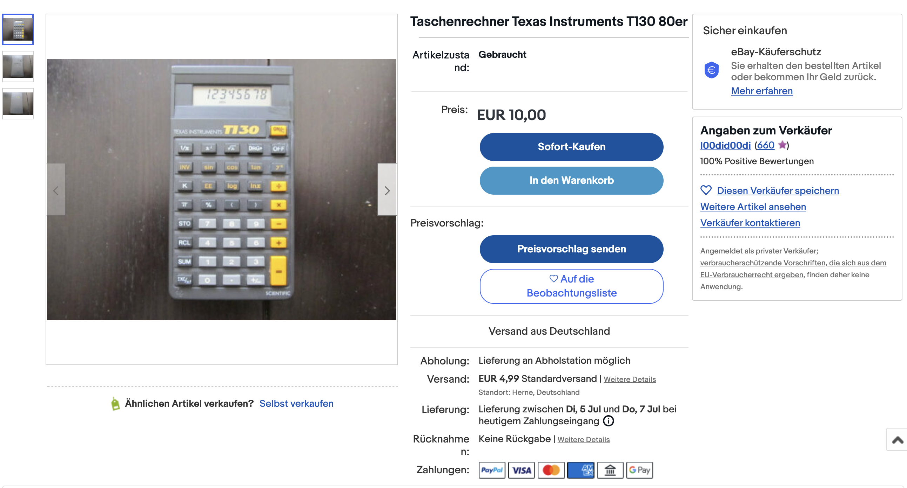
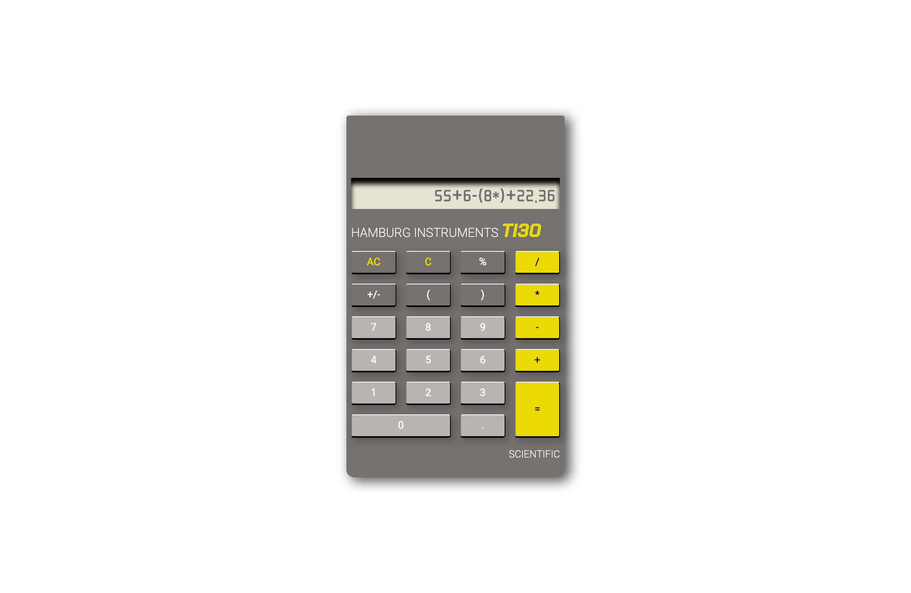

# retro-calculator | An easy online calculator

This is a solution for an easy online calculator. All the UX/UI-Design comes from [https://www.ebay.de/itm/264871409080](https://www.ebay.de/itm/264871409080) 🤪

## Table of contents

- [Overview](#overview)
  - [The challenge](#the-challenge)
  - [Screenshot](#screenshot)
  - [Links](#links)
- [My process](#my-process)
  - [Built with](#built-with)
  - [Continued development](#continued-development)
- [Author](#author)
- [Acknowledgments](#acknowledgments)

## Overview

### The challenge

Use HTML, CSS and JavaScript to create a calculator that can do the basic arithmetic operations of addition, subtraction, multiplication and division.

The input takes place via the keyboard of the pocket calculator (buttons).

- find your own design and build the most beautiful calculator in the world ;)
- find out about JS eval() for the calculation.

### Screenshot

### Links

- Solution URL: [https://github.com/jenniferhubermayer/retro-calculator](https://github.com/jenniferhubermayer/retro-calculator)
- Live Site URL: [https://jenniferhubermayer.github.io/retro-calculator/](https://jenniferhubermayer.github.io/retro-calculator/)

## My process

### Built with

- Semantic HTML5 markup
- CSS custom properties
- Grid
- JavaScript

### Continued Development

- make % work
- make C work and remove the last entry, not the last number or letter
- fill display with 0 as default and overwite on input
- find an alternative for eval() as it should not be used anymore

## Author

- Website - [https://github.com/jenniferhubermayer](https://github.com/jenniferhubermayer)

## Acknowledgments

This project has been realized as part of the [super(c)ode](https://www.super-code.de/) "Front-End Boot-Camp 2022".
